# Complete architecture with GCP UI.

For deploy all the architecture and work with it, you have to do everything step by step. 

## Create a VM image.

For deploy all the VM, if you create a image with the common settings is easier than deploy all the VM and later configure it one by one.

To create the necessary VM image, do the following steps.

1. In your GCP Console, go to the `Compute Engine` item. You should see something like that:

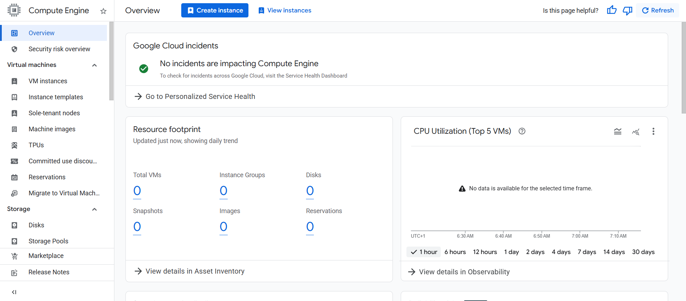

2. Click on `Create instance`. Use the following configuration (You can see on the image): 

     - **Machine configuration**: 
       - **Name**: `ce-storage`.
       - **Region and Zone**: Your decision. 
       - **Type series**: `E2`
       - **Machine type**: `e2-micro`
     - **OS and storage**:
       -  **Debian version**: `Debian GNU/Linux 11 (bullseye)`

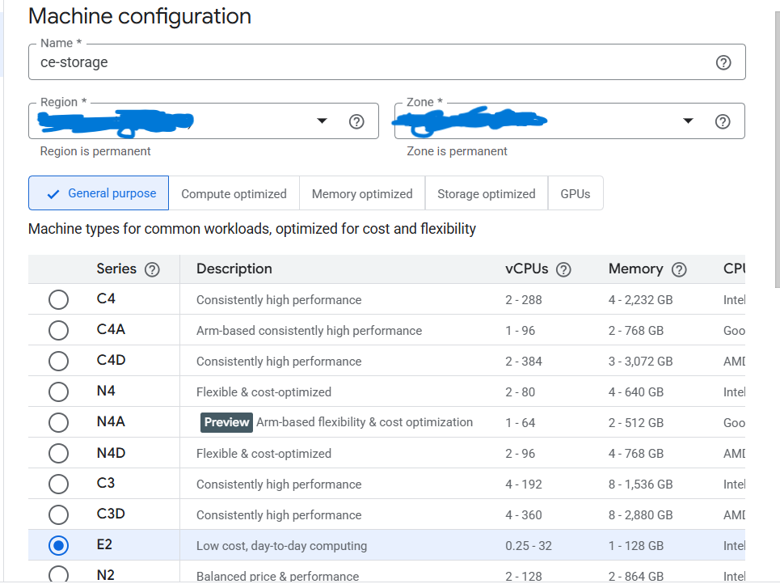

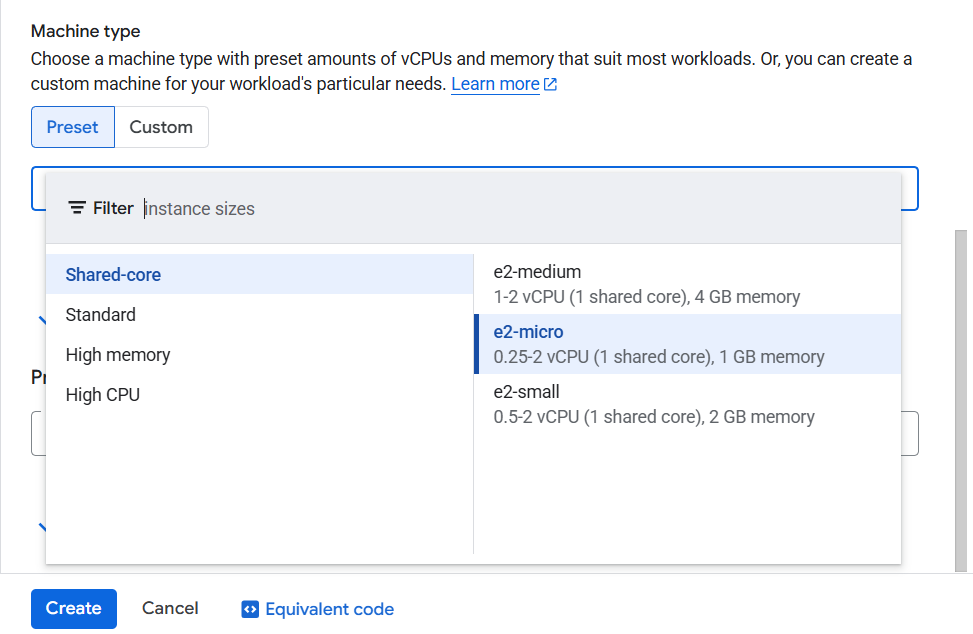

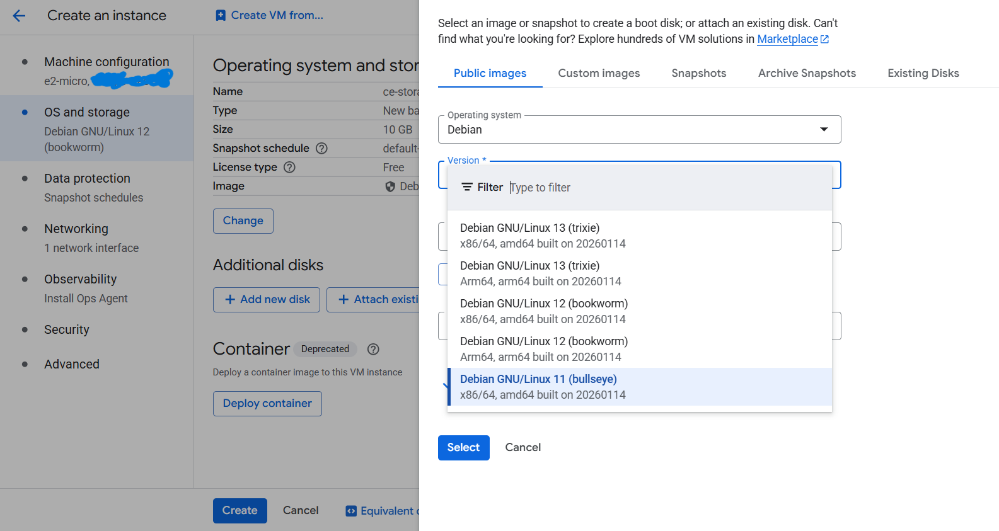

3. Once you have that configuration, click on `Create` to deploy the VM. Now you should see something like that: 

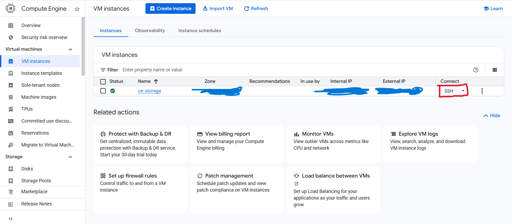

4. Click on SSH (You can see where is it in the previous image). That open a terminal connected with your VM. Using that terminal you have to do the following steps:

   4.1. Update the VM system running the following command:

   ````sh
   sudo apt-get update
   ````

   4.2. Clone this repository on the VM. To clone the repository you have to use the following commands into the VM.

   ````sh
   sudo apt-get install git
   ````

   ````sh
   git clone https://github.com/JaviPlazaRosique/GCP_Storage.git
   ````

   4.3. Install python and the dependencies of the apps on the VM.

     4.3.1. Install python.

     ````sh
     sudo apt-get install python3
     ````

     4.3.2. Install pip for install the dependencies. 

     ````sh
     sudo apt-get install python3-pip
     ````

     4.3.3. Install dependencies. To install it, you need to stay on the correct directory. so run the following commands.

     ````sh
     cd GCP_Storage/e2e/VM
     ````

     ````sh
     pip install --no-cache-dir -r requirements.txt
     ````

5. Once you have that step finish, close the window of the terminal. Then stop the Compute Engine instance clicking `Stop` as you can see on the image:

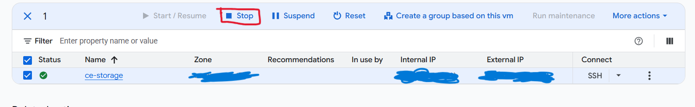

6. Create the VM image clicking the 3 dots at the left and clicking `Create new machine image` as you can see on the image:

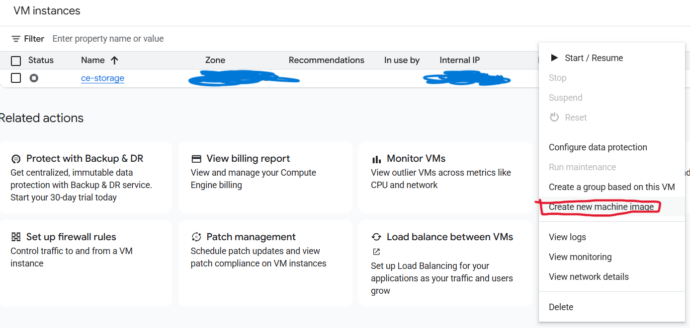

   6.1 Here you only have to put the image name. Put: `img-ce-storage` 

Now you have the VM image. If you want you can delete the Compute Engine instance (THE IMAGE NO).

## Deploy the Compute Engines instances for Orders and Delivery APPs.

If you do the all the steps of the previous section, you should have a VM image. Go to `Machine images` and you will see something like that: 

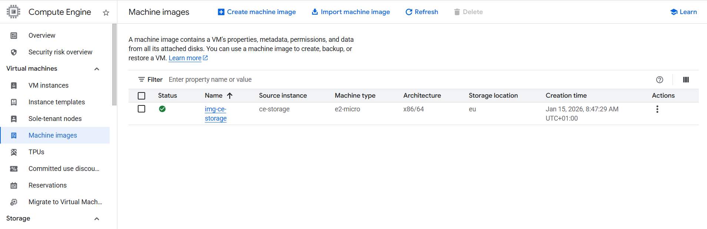

To deploy the necessary instances, you have to do the following process twice. Once for **Orders APP** and once for **Delivery APP**.

To deploy a Compute Engine with a VM image, do the following step.

Staying in the page that you can see in the previous image, click on the 3 dots at the left of the VM image. Then click on `Create instance`. Once you do it you have to configure the instance. To configure it, use the following configuration (You can see in the following images): 
   - **Name**:
     - To Orders APP: `orders-app` 
     - To Delivery APP: `delivery-app`
   - **Region and Zone**: Your decision. 
   - In **Networking**: 
     - **Firewall**:
       - Click on `Allow HTTP traffic`
       - Click on `Allow HTTPS traffic`
     - **Network interface**:
       - Network: `default`
       - Subnetwork: `default IPv4`
   - In **Security**:
     - **Identity and API access**:
       - Change **Access scopes** to `Allow full access to all Cloud APIs`

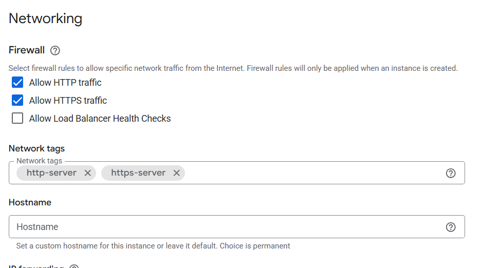

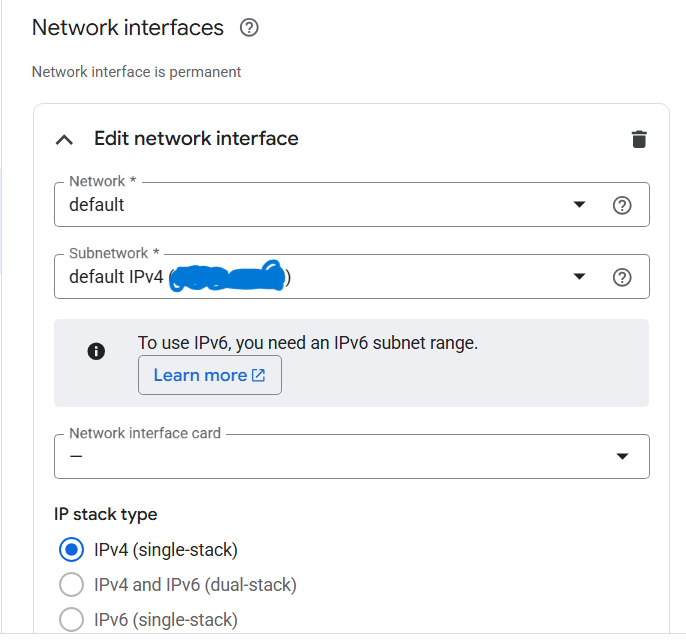


Once you do that, you will have the Compute Engine instances. In the VM instances you needs to have something like that:

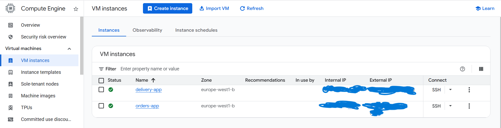

## Create Pub/Sub topics.

To create the Pub/Sub topics you have to do the following steps.

1. Go to Pub/Sub in the console of GCP. You should see something like this:

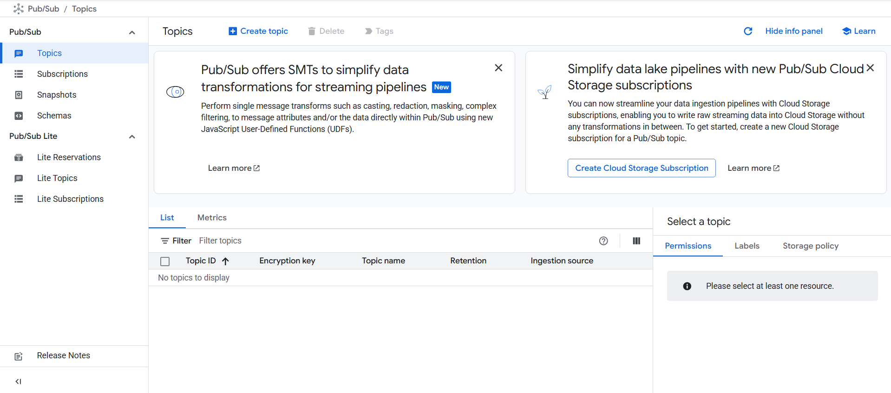

2. Click on `Create topic`. Once you click that, you should see something like this:

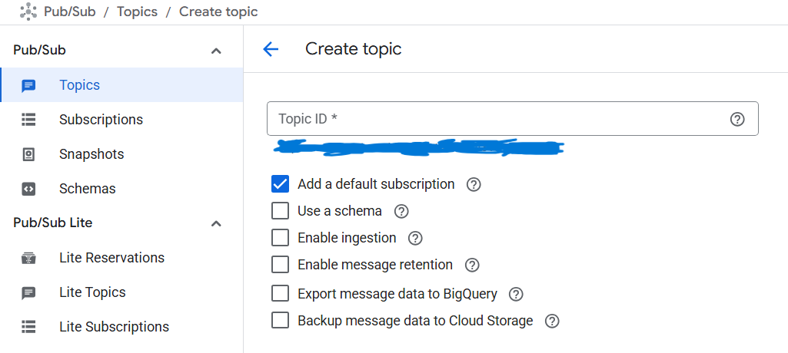

3. Here, you only have to put the `Topic ID`. Do with `Topic ID` = `orders-events`, another time with  `Topic ID` = `delivery-events` and another with `Topic ID` = `delivery-events-dead-letter`

4. Click on `Create` to create the topic.

Once yo do it for both topics, you should see something like these in Pub/Sub topics.

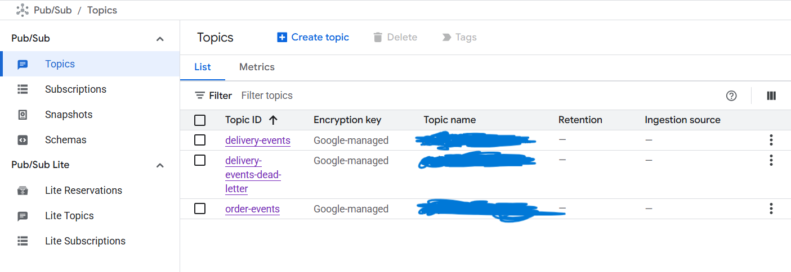

## Deploy Operational database (Cloud SQL)

To deploy the Cloud SQL instance, you have to do the following steps.

1. Go to Cloud SQL in the GCP console. You should see something like that (no if you have another instance):

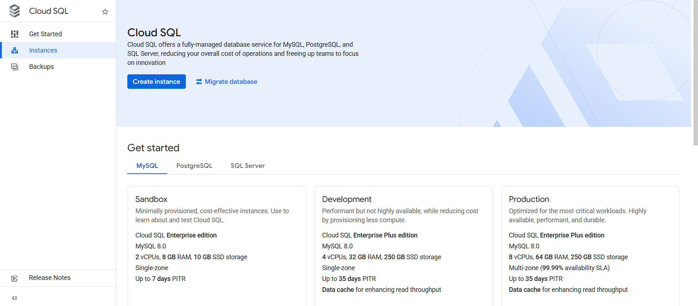

2. Click on `Create instance` to start the configuration of the instance. You should see something like that: 

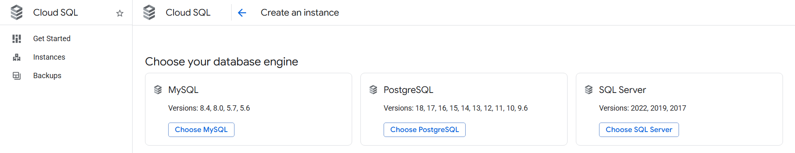

3. Click on `Choose PostgreSQL`, to start the configuration of a PostgreSQL instance.

4. Select the configuration of the instance. The options that you have to change or write are (you can see how to do in the following images):

   - **Edition**: `Enterprise`
   - **Edition preset**: `Development`
   - **Database version**: `PostgreSQL 17`
   - **Instance ID**: `ecommerce`
   - **Password**: Your decision.
   - **Region**: Your decision.
   - **Security**:
     - **SSL mode**: `Allow unencrypted network traffic (not recommended)`

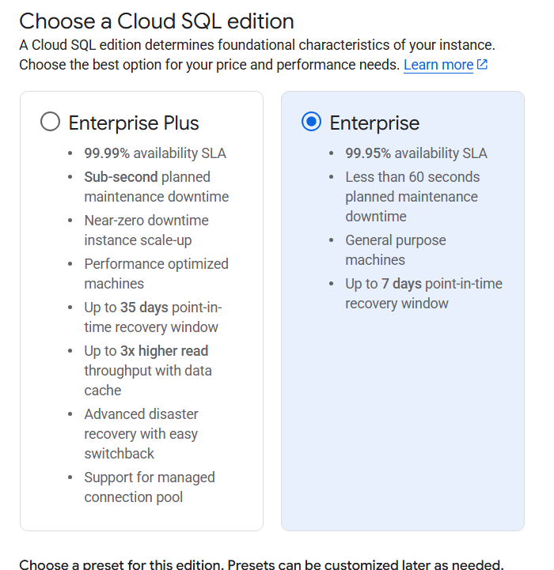

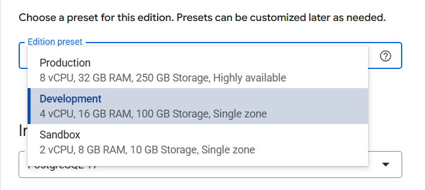

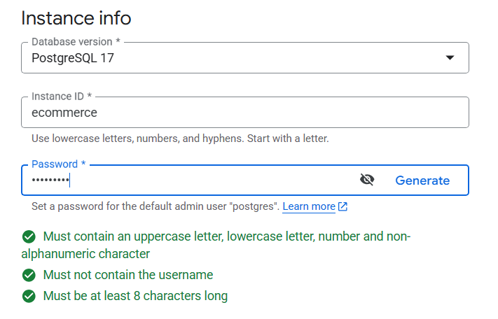

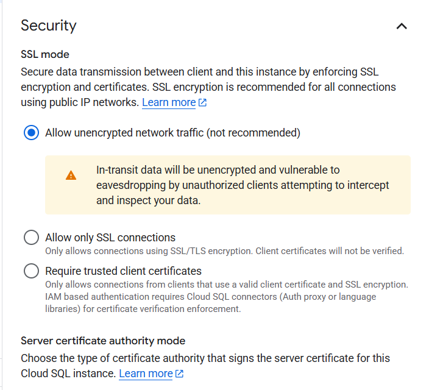

Now you have the Cloud SQL instance, you have to deploy a database into the instance, so go to `Databases` into the instance.

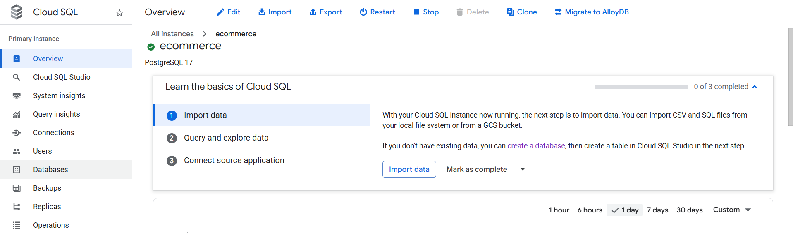

You can create the database doing the following steps.

1. Into `Databases` of the Cloud SQL instance click on `Create database`. You should be something like this: 

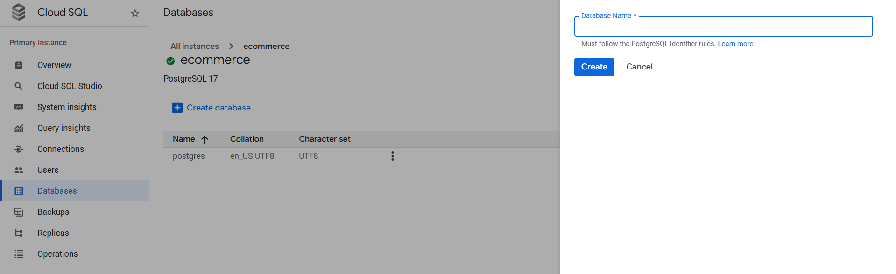

2. Call the database: `ecommerce`

Once you do that, you have to create the tables into the database `ecommerce`. To do that go to Cloud SQL Studio and authenticate yourself. Once your are authenticate, run the next query:

````sql
CREATE TABLE IF NOT EXISTS customers (
    id SERIAL PRIMARY KEY,
    customer_name VARCHAR(255) NOT NULL,
    email VARCHAR(255) UNIQUE NOT NULL
);

CREATE TABLE IF NOT EXISTS products (
    id SERIAL PRIMARY KEY,
    product_name VARCHAR(255) NOT NULL,
    price DECIMAL(10, 2) NOT NULL
);

CREATE TABLE IF NOT EXISTS orders (
    id SERIAL PRIMARY KEY,
    customer_id INT NOT NULL,
    created_at TIMESTAMP NOT NULL,
    total_price DECIMAL(10, 2) NOT NULL,
    FOREIGN KEY (customer_id) REFERENCES customers(id) ON DELETE CASCADE
);

CREATE TABLE IF NOT EXISTS order_products (
    order_id INT NOT NULL,
    product_id INT NOT NULL,
    quantity INT NOT NULL,
    price DECIMAL(10, 2) NOT NULL,
    PRIMARY KEY (order_id, product_id),
    FOREIGN KEY (order_id) REFERENCES orders(id) ON DELETE CASCADE,
    FOREIGN KEY (product_id) REFERENCES products(id) ON DELETE CASCADE
);
````

Once you do that, you should see something like that:

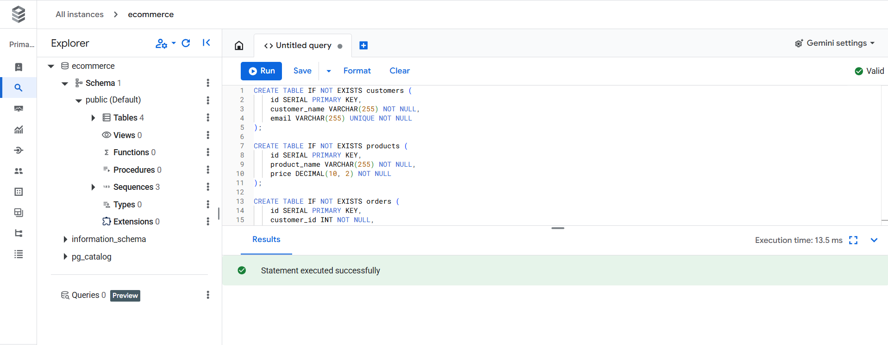

## Deploy BigQuery datasets and tables.

To deploy a BigQuery datasets, you have to do the following steps.

1. Go to BigQuery product in GCP console. You should see something like that:

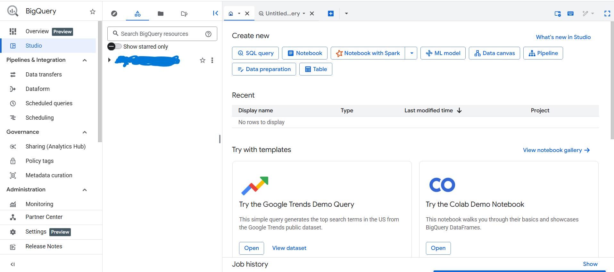

2. Into BigQuery go to `Studio`. Then on the `Studio`, go to the `Explorer`. And into that, go to `Datasets`

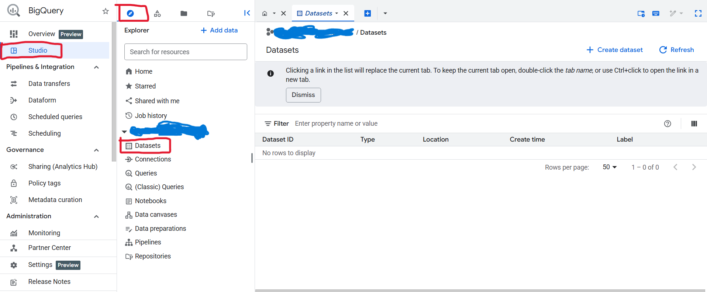

3. Create the datasets clicking on `Create datasets`. Create two, one with `Dataset ID` = `orders_bronze`, and another with `Dataset ID` = `delivery_bronze`. And in both, put `Data location` = `europe-west1`

Once you do all, you should see something like that: 


To deploy the necessary tables you have to do the following steps.

1. Open a Query script. You have to click on the bottom that you can see on the following image:

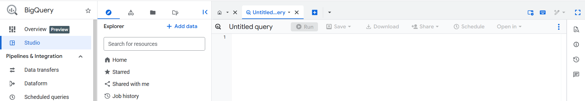

2. In that script, you have to run the following command:

````sql
CREATE TABLE `orders_bronze.customers` (
  id INT64,
  customer_name STRING,
  email STRING
);

CREATE TABLE `orders_bronze.products` (
  id INT64,
  product_name STRING,
  price FLOAT64
);

CREATE TABLE `orders_bronze.orders` (
  id INT64,
  customer_id INT64,
  created_at TIMESTAMP,
  total_price FLOAT64
);

CREATE TABLE `orders_bronze.order_products` (
  order_id INT64,
  product_id INT64,
  quantity INT64,
  price FLOAT64
);

CREATE TABLE `delivery_bronze.raw_events_delivery` (
  subscription_name STRING,
  message_id STRING,
  publish_time TIMESTAMP,
  data JSON,
  attributes JSON
)
PARTITION BY DATE(publish_time)
CLUSTER BY subscription_name, message_id
OPTIONS (
  labels = [("source", "bq_subs")]
);
````

If you do it all perfect, you should see something like that: 

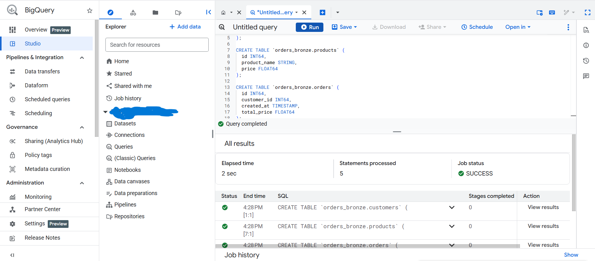

## Pub/Sub subscription to BigQuery.

To create a BigQuery subscription to Pub/Sub, you have to do the following steps.

1. Authorize the Pub/Sub service account to write in BigQuery.

   1.1. Go to BigQuery Studio.

   1.2. In your project, go to databases.

   1.3. Go to `delivery_bronze` database.

   1.4. Click on the 3 dots at the left of the `raw_delivery_events` table as you can see in the following image:

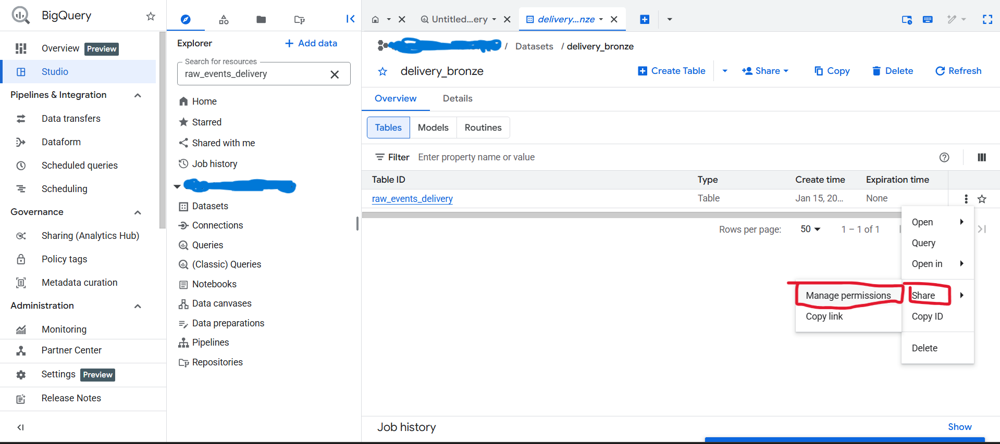

   1.5. Click on `Share`, and in `Manage permissions`.  

   1.6. In the window who is open, click on `Add principal`

   1.7. In the window that GCP open, you have to use the following configuration (you can see on the image):

   - **New principal**: service-<your project number>@gcp-sa-pubsub.iam.gserviceaccount.com
   - **Role**: `BigQuery Data Editor`

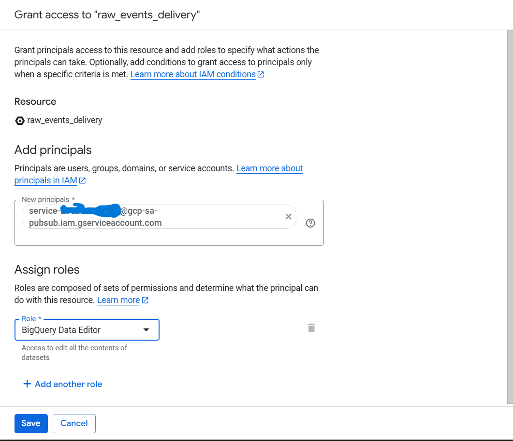

**Project number** $\Longrightarrow$ You can found your project number on the initial dashboard of GCP console.

   1.8. Click on `Save`.

2. Go to Pub/Sub in GCP console. Into that go to `Subscriptions`.

3. Click on `Create subscription`. Put the following configuration into the subscription (you can see in the following image).

   - **Subscription ID**: `delivery-events-bq-sub`
   - **Pub/Sub topic**: The topic whose contains `/topics/delivery-events` 
   - **Delivery type**: `Write to BigQuery`
     -   **Project**: Your project.
     -   **Dataset**: `delivery_bronze`
     -   **Table**: `raw_events_delivery`
         -   **Schema configuration**: `Don't use a schema`

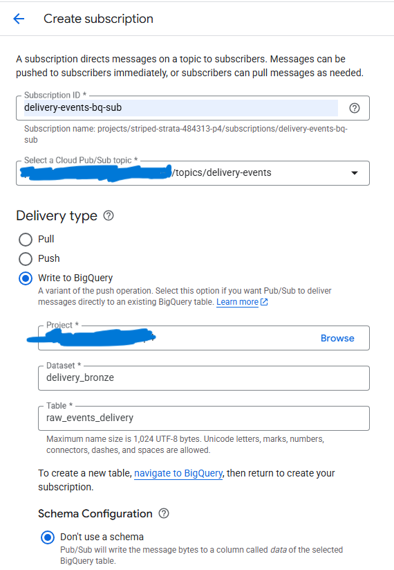

## Deploy the Cloud Storage Bucket.

You need to deploy a bucket in Cloud Storage to use it like a data lake. To deploy the bucket you have to go to the Cloud Storage product in GCP console. You should see something like that: 

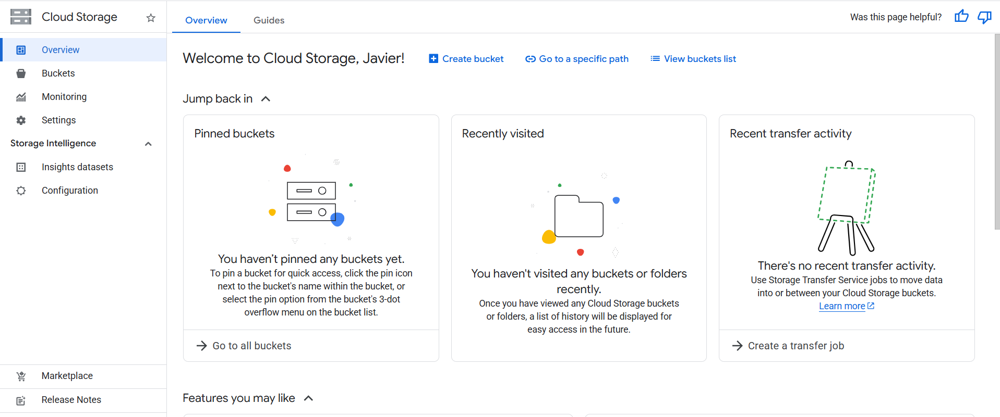

To deploy the bucket you have to do the following steps. 

1. Click on `Create bucket`, to start with the configuration of the bucket. You can see the bottom in the previous image.

2. Into the configuration you have to use the following configuration (you can see in the following image):  

   -  **Bucket name**: `e2e-gcp-storage-<what you want (a number, a name, ...)>` The buckets are globally so they need to have a unique name.
   -  **Region**: Your decision.

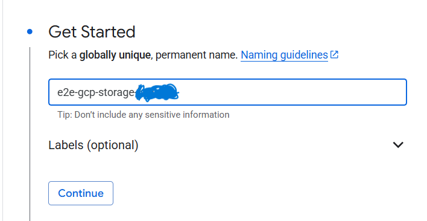

## Give permissions to the Compute Engine SA.

To use the complete architecture, the service account of the Virtual Machines needs permission to do something actions.

To give permissions to the SA you have to go to do the following steps.

1. In the GCP console go to `Service Accounts` into `IAM & Admin`. You should see the Compute Engine default service account (You can see it in the following image). The default service account have the next format: 

   - `<Your project number>-compute@developer.gserviceaccount.com` 


2. Click on the Compute Engine default service account. 

3. Into de service account, go to `permissions`. You should see something like that: 

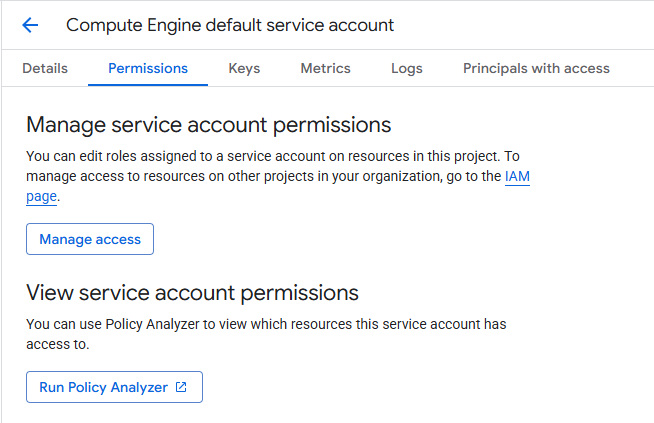

4. Click on `Manage access` and add the following roles (you can see in the following image):

   - `Cloud SQL Client` 
   - `Storage Object User` 
   - `Pub/Sub Editor` 

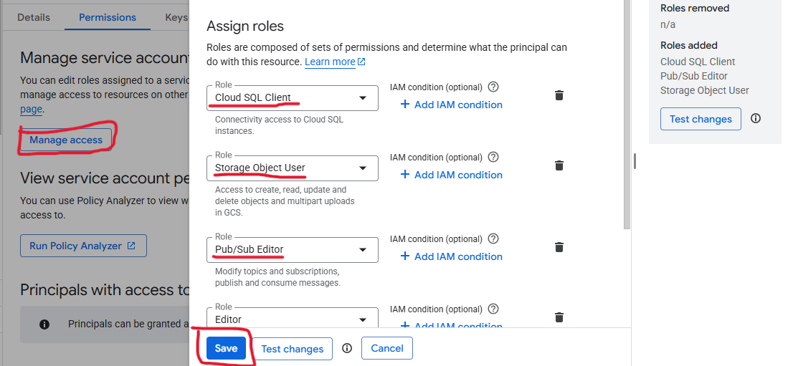

5. Click on save

## Run the Orders APP and the Delivery APP.

The first step that you have to do is authorize the Virtual Machines to connect with the Cloud SQL instance. To do this you have to do the following steps.

1. Go to the VM instances in GCP console. Here you have to copy the `External IP` of `delivery-app` and `orders-app` instances. You can see it in the following image: 

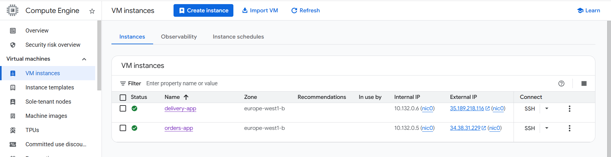

2. Go to ecommerce instance into Cloud SQL. Here go to `Connections`, and into that, go to `Networking`. You can see it in the following image: 

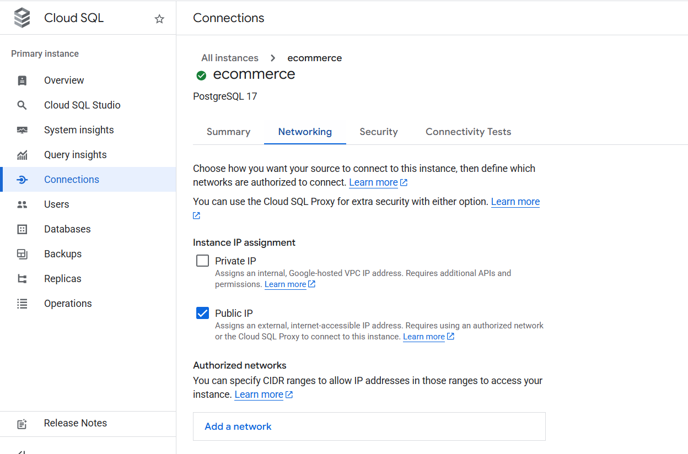

3. Click on `Add a network`. Add the external IP of both VM.

Remember that when you stop a VM, the IP changes, and you have to do the same process.

### Orders APP. 

To use the orders app you have to open the terminal of the `orders-app` compute engine. 

If you don't know how to do that go to [Create a VM image](#create-a-vm-image).

You have to stay into the correct directory. To go into that, you have to run the following command: 

````sh
cd GCP_Storage/e2e/VM/
````

Now you have to set the environment variables. You can do it with the following commands:

````sh
export PASSWORD_SQL=<The password that you put in the Cloud SQL instance>
export GCS_BUCKET_NAME=e2e-gcp-storage-<The other thing that you put>
export HOST_IP=<The Public IP address of your Cloud SQL instance>
````

You can found de Public IP address of your Cloud SQL instance in the product of Cloud SQL in GCP console. You can see it in the following image: 

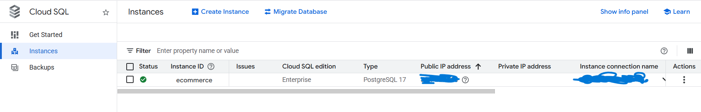

In the terminal, run the following command:

````sh
nohup bash -c 'python3 -m orders_app.orders_to_db.main' > output.log 2>&1 &
````

This will start creating orders, store them in the database and publish confirmation events to the `order-events` topic.

If you want to see the logs, run the following command:

```sh
tail -f output.log
```

### Delivery APP.

To use the delivery app you have to open the terminal of the `delivery-app` compute engine.

If you don't know how to do that go to [Create a VM image](#create-a-vm-image).

You have to stay into the correct directory. To go into that, you have to run the following command: 

````sh
cd GCP_Storage/e2e/VM/
````

Now you have to set the environment variables. You can do it with the following commands:

````sh
export PROJECT_ID=<Your project ID in GCP>
````

In the terminal, run the following command:

````sh
nohup bash -c 'python3 -m delivery_app.main' > output.log 2>&1 &
````

If you want to see the logs, run the following command:

````sh
tail -f output.log
````

## Connect BigQuery to the Cloud Storage. 

Now that we have the parquet file created in our bucket, we will create a external table in BigQuery to access its content. You have to do the following steps: 

1. Go to BigQuery GCP console. 

2. Select the dataset `orders_bronze`.

3. Into the dataset, click on `Create Table`. That will open a configuration page.

4. Put the following configuration (you can see on the following images): 

   - **Source**:
     - **Create table from**: `Google Cloud Storage`
     - **Select file from GCS bucket**: You have to browse to find the file. The directory is going to be something like that: `e2e-gcp-storage-<The thing that you put>/raw_data/products_additional_info.parquet`
   - **Destination**:
     - **Table**: `raw_additional_products_info`
     - **Table type**: `External table`
   - **Schema**:
     - Click on `Auto detect`

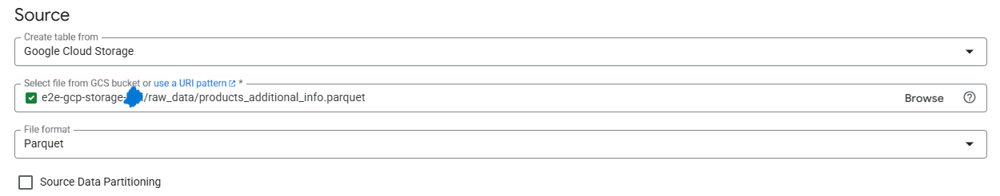

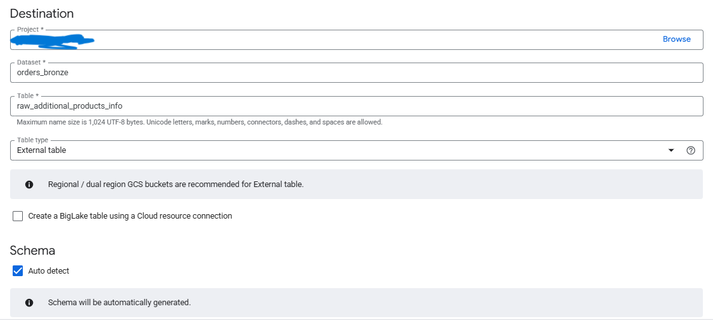

5. Click on `Create table`.

In that moment, you should have all of the cloud architecture. 

# On-Premise part.

To use the this part is you need o have [Anaconda](https://www.anaconda.com/download).

Once you have anaconda, you have to create a python environment with Anaconda. To create that run the following command in your terminal: 

````sh 
conda create --name e2e_gcp_storage python=3.11
````

Once you have the environment you have to activate it. To do it run the following command: 

````sh
conda activate e2e_gcp_storage
````

Now you have to stay in the directory `on_premise`. Once you are in that directory, run the following command: 

````sh
pip install -r requirements.txt
````

**Extra commands**

To deactivate the python environment you have to run the following command: 

````sh 
conda deactivate
````

To delete the environment, run the following command: 

````sh
conda env remove -n e2e-gcp-storage
````
## Extract-Load.

To do this part, you have to add your IP to the Cloud SQL instance. You have the instructions in [Run the Orders APP and the Delivery APP](#run-the-orders-app-and-the-delivery-app).

Now you have to deploy the EL pipeline to synchronize the Cloud SQL database with BigQuery. To do that, you have to run the following command (you have to stay in the `on_premise/` directory):

````sh
POSTGRES_IP=<The public IP of the Cloud SQL instance> GCP_PROJECT=<Your project id> POSTGRES_PASSWORD=<The password of the Cloud SQL> python -m el_orders.main
````

## DBT.

For this part you have to create the directory `gcp_storage_project/` into the directory `on_premise/dbt/`. 

Into the new directory you have to copy all the files into the directory `template` and change the file `profiles.yml` with your information. 

To use DBT you have to create a service account to bring permission to dbt. To create it you have to do the following steps:

1. Go to IAM & Admin in GCP Console. 

2. Go to Services accounts.

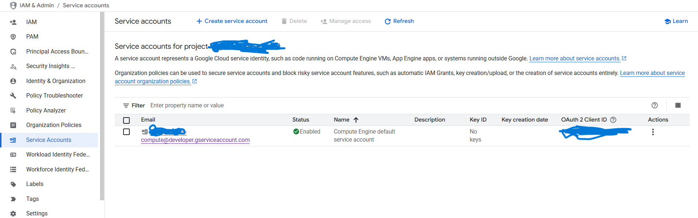

3. Click on `Create service account`.

4. Set the following configuration (you can see in the following steps): 

   - **Service account name**: `dbt-storage-project`
   - **Permissions**:
     - **Role**: `BigQuery Data Owner` and `BigQuery Job User`

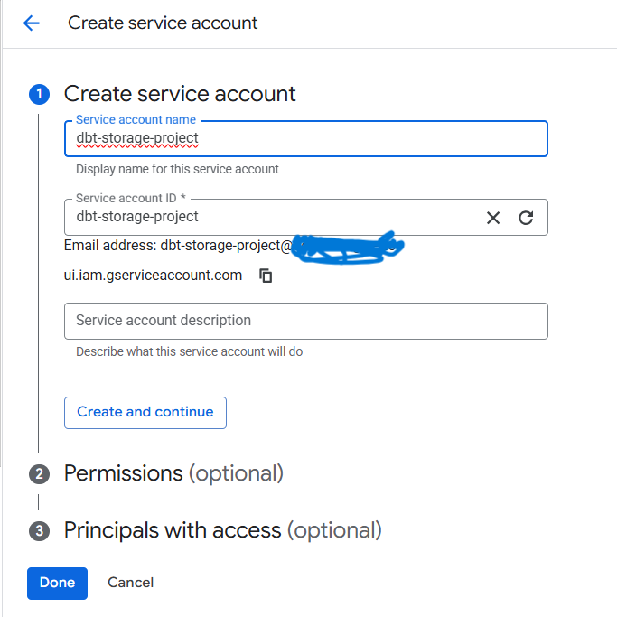


5. Click on `Done`.

Now you have the service account. To use it you have to do the following steps:

1. Click on `Manage keys` into the service account.

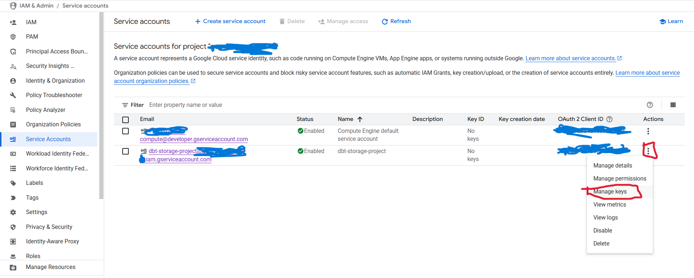

2. Click on `Add key`.

3. Click on `Create new key`.

4. Select `JSON` and click on create. 

Now you have a JSON in your computer. Put it in the directory `on_premise/dbt/gcp_storage_project/`